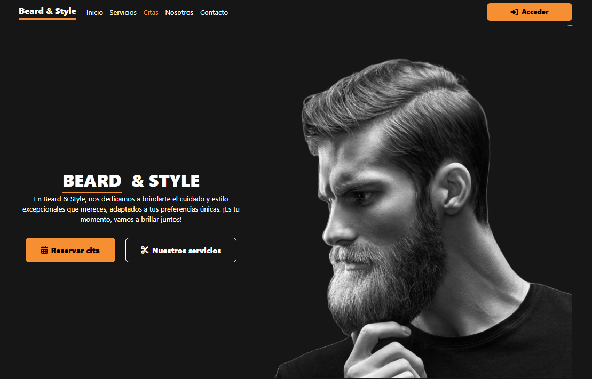

# BeardStyle - Sistema Integral para Barberías

BeardStyle es una plataforma web moderna para la gestión de barberías, que permite a los usuarios reservar y gestionar citas, y a los administradores controlar servicios y usuarios. El sistema está compuesto por un backend robusto en Django REST Framework y un frontend atractivo en Vue.js.

---

## Tabla de Contenidos

- [1. Descripción General](#1-descripción-general)
- [2. Vista Previa](#2-vista-previa)
- [3. Estructura del Proyecto](#3-estructura-del-proyecto)
- [4. Tecnologías Utilizadas](#4-tecnologías-utilizadas)
- [5. Requisitos del Sistema](#5-requisitos-del-sistema)
- [6. Guía de Instalación y Ejecución](#6-guía-de-instalación-y-ejecución)
- [7. Acceso a los Servidores](#7-acceso-a-los-servidores)
- [8. Documentación del Backend](#8-documentación-del-backend)
- [9. Documentación del Frontend](#9-documentación-del-frontend)
- [10. Documentación de la API](#10-documentación-de-la-api)
- [11. Resolución de Problemas](#11-resolución-de-problemas)
- [12. Contribuciones](#12-contribuciones)
- [13. Licencia](#13-licencia)
- [14. Contacto](#14-contacto)

---

## 1. Descripción General

BeardStyle integra un backend seguro y escalable con Django REST Framework y un frontend SPA (Single Page Application) en Vue.js. Los usuarios pueden registrarse, iniciar sesión, reservar citas, y los administradores pueden gestionar servicios y usuarios desde un panel dedicado.

---

## 2. Vista Previa

<p align="center">
  
</p>
<p align="center">
  
</p>

---

## 3. Estructura del Proyecto

```
pagBeardStyle/
├── backend/                  # API REST en Django
│   ├── barber_app/           # App principal (modelos, vistas, serializers)
│   ├── barbershop/           # Configuración del proyecto Django
│   ├── manage.py             # Script de gestión Django
│   ├── requirements.txt      # Dependencias Python
│   └── API_README.md         # Documentación de la API REST
├── frontend/                 # Aplicación Vue.js
│   ├── public/               # Archivos estáticos (CSS, imágenes)
│   ├── src/                  # Código fuente Vue
│   │   ├── assets/           # Recursos internos
│   │   ├── components/       # Componentes reutilizables
│   │   ├── composables/      # Lógica reutilizable (useAuth, etc.)
│   │   ├── layouts/          # Layouts principales (Header, Footer)
│   │   ├── pages/            # Páginas completas (Citas)
│   │   ├── router/           # Configuración de rutas
│   │   ├── sections/         # Secciones de página (Hero, Servicios)
│   │   ├── services/         # Servicios API (auth, appointments)
│   │   └── views/            # Vistas (Login, Register)
│   ├── .env.local            # Variables de entorno locales
│   ├── package.json          # Dependencias JavaScript
│   └── README.md             # Documentación frontend
└── README.md                 # Este documento principal
```

---

## 4. Tecnologías Utilizadas

**Backend:**
- Django 4.2+
- Django REST Framework
- SQLite (desarrollo) / PostgreSQL (producción)
- Django CORS Headers

**Frontend:**
- Vue.js 3
- Vue Router
- Axios
- Bootstrap 5
- FontAwesome

---

## 5. Requisitos del Sistema

- **Python** 3.8+ (recomendado 3.12 o inferior para compatibilidad)
- **Node.js** 14+
- **npm** 6+ o yarn
- Navegador moderno (Chrome, Firefox, Edge)
- Base de datos SQLite (desarrollo) o PostgreSQL (producción)

---

## 6. Guía de Instalación y Ejecución

### Backend (Django)

1. Abre una terminal y navega a la carpeta `backend`:
   ```bash
   cd backend
   ```
2. Crea y activa el entorno virtual:
   ```bash
   python -m venv venv
   # En Windows:
   .\venv\Scripts\activate
   # En Linux/Mac:
   source venv/bin/activate
   ```
3. Instala las dependencias:
   ```bash
   pip install -r requirements.txt
   ```
4. Aplica migraciones:
   ```bash
   python manage.py migrate
   ```
5. (Opcional) Crea un superusuario:
   ```bash
   python manage.py createsuperuser
   ```
6. Inicia el servidor de desarrollo:
   ```bash
   python manage.py runserver
   ```

### Frontend (Vue.js)

1. Abre otra terminal y navega a la carpeta `frontend`:
   ```bash
   cd frontend
   ```
2. Instala las dependencias:
   ```bash
   npm install
   ```
3. Inicia el servidor de desarrollo:
   ```bash
   npm run serve
   ```

---

## 7. Acceso a los Servidores

- **Backend (Django):**  
  [http://localhost:8000](http://localhost:8000)  
  (Panel de administración: [http://localhost:8000/admin/](http://localhost:8000/admin/))

- **Frontend (Vue.js):**  
  [http://localhost:8080](http://localhost:8080)

---

## 8. Documentación del Backend

- **Estructura:**  
  - `barber_app/`: Modelos, vistas, serializadores y lógica de negocio.
  - `barbershop/`: Configuración global del proyecto.
- **Configuración:**  
  - Variables de entorno recomendadas en `.env` (ver ejemplo en `API_README.md`).
  - CORS y CSRF configurados para desarrollo seguro.
- **Panel de administración:**  
  - Gestiona usuarios, citas y servicios desde `/admin/`.
- **Documentación extendida:**  
  - Ver `backend/API_README.md` para detalles de modelos, endpoints y ejemplos.

---

## 9. Documentación del Frontend

- **Estructura modular:**  
  - Componentes reutilizables (`src/components/`), layouts (`src/layouts/`), secciones de landing (`src/sections/`), servicios API (`src/services/`), rutas (`src/router/`).
- **Autenticación:**  
  - Manejo de sesión y CSRF integrado con el backend.
- **Estilos:**  
  - Personalización en `public/assets/css/styles.css`.
- **Desarrollo:**  
  - Comentarios explicativos en los archivos `.vue` y `.js`.
- **Variables de entorno:**  
  - Configura la URL de la API en `.env.local` si es necesario.

---

## 10. Documentación de la API

- **Referencia completa:**  
  Consulta [`backend/API_README.md`](backend/API_README.md) para:
  - Modelos de datos (`Usuario`, `Appointment`)
  - Endpoints REST (registro, login, citas, etc.)
  - Ejemplos de peticiones y respuestas
  - Seguridad (CORS, CSRF, autenticación)
  - Guía de extensión y testing

---

## 11. Resolución de Problemas

- **Error CSRF:**  
  Asegúrate de enviar el token CSRF en el header `X-CSRFToken` y que las cookies se envían correctamente.
- **401 Unauthorized:**  
  Verifica que la sesión esté activa y que el usuario esté autenticado.
- **CORS:**  
  Confirma que el origen del frontend esté en `CORS_ALLOWED_ORIGINS` en el backend.
- **Problemas con dependencias:**  
  Usa Python 3.12 o inferior para evitar incompatibilidades con algunos paquetes.
- **Citas no aparecen:**  
  Verifica autenticación y revisa la consola del navegador y los logs del backend.

---

## 12. Contribuciones

1. Haz un fork del repositorio.
2. Crea una rama para tu feature.
3. Realiza tus cambios siguiendo las buenas prácticas de Django y Vue.
4. Escribe tests para tu código.
5. Envía un Pull Request.

---

## 13. Licencia

Este proyecto está bajo la Licencia MIT.

---

## 14. Contacto

- **Autor:** LeoniBres
- **Email:** leonibresjimenez@gmail.com

¿Tienes sugerencias o encontraste un problema? ¡Contribuye o abre un issue!

---
